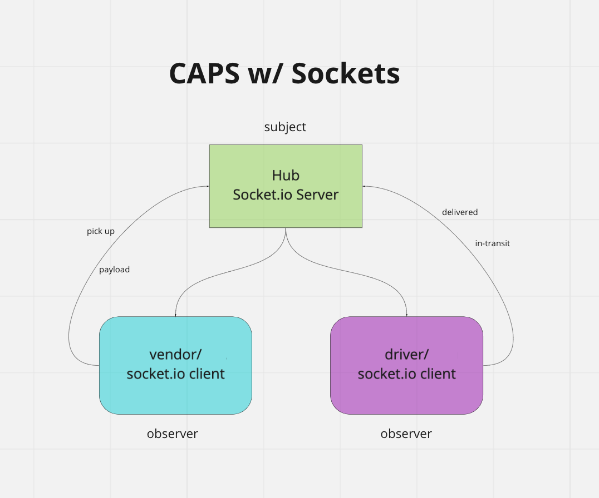

# caps

Created by Harvey Lucas and Roop Hayer

## Usage

Use of this project requires three terminals. After following the Installation instructions below, open three terminals in the project root directory. The following commands should be run, one per terminal, in the order listed. Alerts are generated at two second intervals.

1. In terminal 1, run `node ./Hub/server.js`
2. In terminal 2, run `node ./Driver/driver.js`
3. In terminal 3, run `node ./Vendor/vendor.js `

## Installation

```plaintext
> npm install faker jest socket.io socket.io-client
```

## Summary of Problem Domain

### Lab: Class 12

Socket.io - Code Academy Parcel Service (CAPS)

Create a real-time service that allows for vendors, such as flower shops or restaurants, to alert a system of a package needing to be delivered, for drivers to instantly see what’s in their pickup queue, and then to alert the vendors as to the state of the deliveries (in transit, and then delivered).

### Phase 2 Requirements

In Phase 2, we’ll be changing the underlying networking implementation of our CAPS system from using node events to using a library called socket.io so that we can do networked events. Socket.io manages the connection pool for us, makes broadcasting much easier to operate, and works well both on the terminal (between servers) and with web clients.

## Visual


